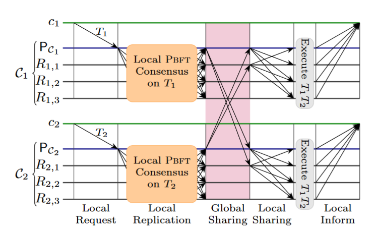

 ## My_PBFT

实现功能：以地理位置来进行分成不同集群，每个集群独立进行PBFT共识，同时每个集群内通过信誉积分选择最值得相信的节点作为当前集群的代表节点（主节点），所有代表节点形成一个上层的委员会，来实现共享本地集群内的共识以实现全局共享，每个代表节点在收到其他集群的提案后会共享给本地集群内的成员。

存在三种实体：客户端、主节点、成员节点。

可以将对主节点的监控分为链上和链下两种，委员会成员验证和离线验证！

[2024-3-9] 

为每个节点增加公私钥对,用于共识时节点信息验证! 主要在节点开始时生成公私钥对，
每次发送信息时要用私钥加密，验证收到信息时要通过公钥验证，验证通过才同意。

[2024-3-11] 

rsa修改完成，现在每次只能发送一次信息，也就是说完成一次共识之后的状态没有回调，
同时每次完成commit之后没有清空缓存，预计一天修改完成后开始设计分组共识。

每次一个节点正确执行完成任务之后也有可能因为网络问题没有正常返回reply信息，
需要给他们留有这种容错。

PBFT 基本共识实现完成（除了 viewchange ），准备分集群测试。

[2024-3-12]

先分三组，每组固定一个主节点PC，当主节点收到请求时先达成组内共识，在commit结束后，
主节点将组内共识分别共享给另外两组内f + 1个节点。
需求： 
* 本地共识结束之后，节点先不要执行任务，主节点将组内共识分别共享给另外两组内f + 1个节点。
需要发送的消息m = {cluster,nodeLD,committedMsg,sign}
* 需要为每个节点开一个新的goroutine，用于处理全局的消息。
* 需要一个新的http 路由 ./global 关联处理函数server.getglobal，
当这个函数收到其他组主节点发送的消息，就会将这个消息广播给组内其他成员
* 在本地收到2f个全局共享共识的确认后将该共识动作放到缓存池中，等待所有动作的顺序执行。

已经完成第一次全局消息的分发，明天来修改reply函数，更改为顺序执行；（在geobft中 ，
最后的排序和执行任务阶段是顺序执行，这样才能保证区块的一致性）。

[2024-3-13]

**！！！原来的PBFT还有问题，当请求很多很快的时候，有的节点如果慢了（比如此时其他三个节点已经
完成viewID 20 的执行和reply，它还在viewID 19 的共识等待commit或者prepare，这时候就会
造成系统死锁**
这个问题晚点来解决。

待修改：
* “在 GeoBFT 中，我们使用的 Pbft 实现只对客户端请求和提交消息
使用数字签名，因为只有这些消息需要转发” 修改数字签名的使用方式
* 要保证最后的节点发送给主节点的committed消息一定能收到
* “为了在通信可靠且延迟有界的情况下保证终止，Pbft 使用视图变化和检查点。"
视图变化就是本地viewchange，这个晚点实现，检查点是保证非故障节点能够从故障和恶意行为中恢复
* 注意修改成上图的Local Sharing！
* 当集群 C 在某一轮中没有客户请求可执行时，主 PC 可以提出一个不执行请求（no-op-request）。
当主 PC 开始从其他群集接收第 ρ 轮的客户请求时，它就能检测到第ρ 轮是否需要这样的无操作请求。这种不操作请求也需要通过本地复制获得提交证书。
